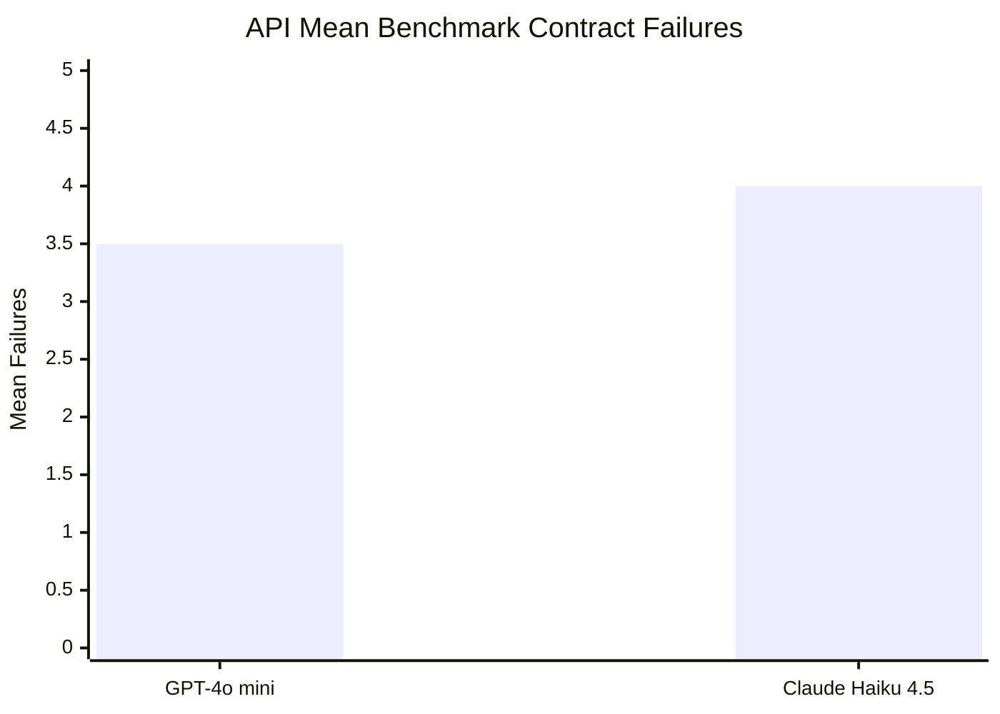
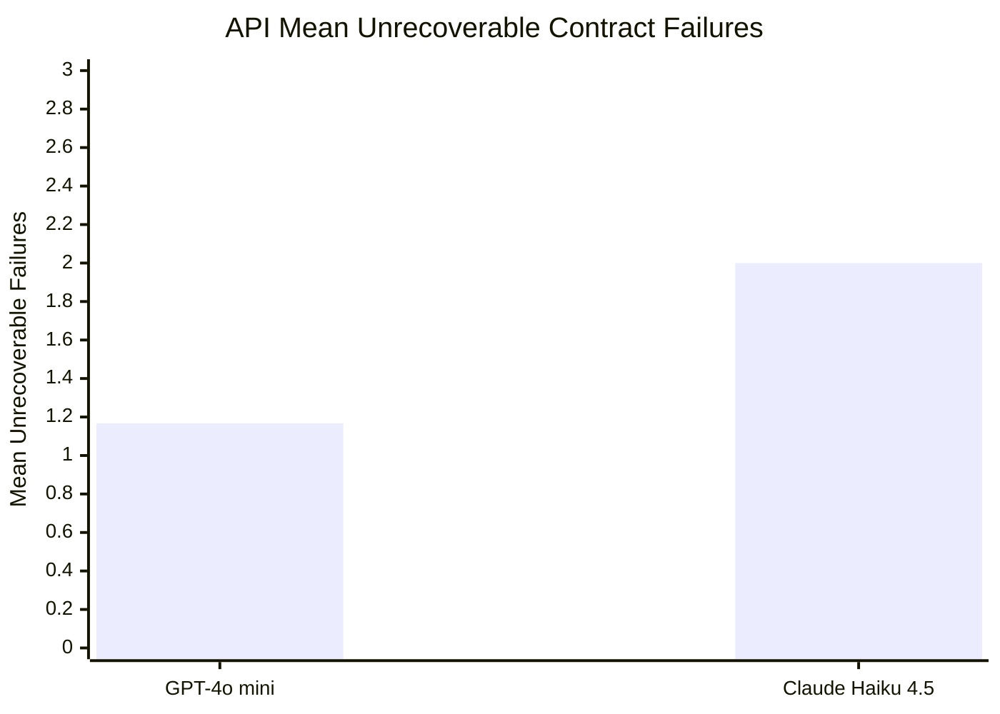
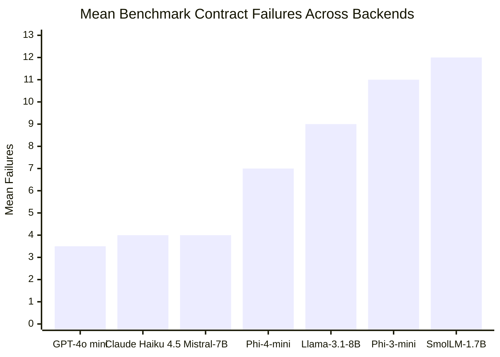

# API Extension Results

This note summarizes the LTE extension runs on hosted API models and compares them to the existing local-model sweep. The purpose is not to produce a general model ranking. The purpose is to show whether the deployer-side scaffold transfers to remote inference backends and whether it still separates models into meaningful operational regimes.

## Scope

- **OpenAI**: `gpt-4o-mini`
- **Anthropic**: `claude-haiku-4-5-20251001`
- **Shared scaffold**: same four suites, same contracts, same baseline parameter grid, same intervention logic
- **Backend-specific calibration**: API latency uses the API-specific hard-trigger rule described in [api_backend_calibration.md](api_backend_calibration.md)

The API baseline now mirrors the local baseline structure:

- temperatures: `0.0`, `0.2`
- max tokens: `192`
- seeds: `0`, `1`, `2`
- total: **6 runs per API model**

Local results below come from `results/weekend_sweep_full/baseline_phase_summary.json`. API results come from `results/api_baseline_sweep/baseline_phase_summary.json`.

## API Baseline Summary

### Table 1. Hosted-model baseline summary (6 runs each)

| Model | Backend | Runs | Recommendation counts | Trigger fire counts | Mean benchmark failures | Mean recoverable failures | Mean unrecoverable failures | Mean stress latency (ms) |
| --- | --- | ---: | --- | --- | ---: | ---: | ---: | ---: |
| GPT-4o mini | `openai` | 6 | `retry`: 6 | `over_expansion`: 6 | 3.5 | 2.333 | 1.167 | 1625.569 |
| Claude Haiku 4.5 | `anthropic` | 6 | `escalate`: 6 | `context_decay`: 6, `over_expansion`: 6 | 4.0 | 2.0 | 2.0 | 1607.826 |

### Figure 1. API mean benchmark contract failures

### Figure 2. API mean unrecoverable failures

### Table 2. Stable API regimes across six runs

| Model | Stable regime | Key pattern |
| --- | --- | --- |
| GPT-4o mini | `retry` | Repeated over-expansion without context-decay trigger |
| Claude Haiku 4.5 | `escalate` | Repeated over-expansion plus repeated context-decay failures |

## API Interpretation

The most important result is not that the API models “worked.” It is that the scaffold produced stable and interpretable regimes across repeated hosted runs.

`gpt-4o-mini` landed in `retry` on all six runs. Its failures were concentrated in bounded-output and formatting pressure, with an average of 3.5 benchmark contract failures and only 1.167 unrecoverable failures. The trigger pattern was consistent: `over_expansion` fired in all six runs, and no additional trigger family crossed the intervention threshold.

Claude Haiku 4.5 landed in `escalate` on all six runs. The difference was not stress collapse. Mean stress latency was similar to `gpt-4o-mini`, and it completed the stress procedure in every run. The difference was context integrity: `context_decay` fired in all six runs alongside `over_expansion`, and unrecoverable failures averaged 2.0 per run.

That is a useful hosted-model distinction for the paper. Both models remained operational under stress, but only one stayed below the context-decay trigger threshold.

## Combined Comparative Analysis

### Table 3. Local and API baseline comparison

| Model | Backend | Runs | Recommendation counts | Trigger fire counts | Mean benchmark failures | Mean unrecoverable failures | Regime |
| --- | --- | ---: | --- | --- | ---: | ---: | --- |
| GPT-4o mini | `openai` | 6 | `retry`: 6 | `over_expansion`: 6 | 3.5 | 1.167 | stable `retry` |
| Claude Haiku 4.5 | `anthropic` | 6 | `escalate`: 6 | `context_decay`: 6, `over_expansion`: 6 | 4.0 | 2.0 | stable `escalate` |
| Mistral-7B-Instruct-v0.3 | `mlx` | 6 | `abort`: 6 | `latency_cliff`: 6, `over_expansion`: 6, `persistent_failure`: 6 | 4.0 | 1.0 | stable `abort` |
| Phi-4-mini-instruct-8bit | `mlx` | 6 | `escalate`: 6 | `context_decay`: 6, `over_expansion`: 6 | 7.0 | 3.0 | stable `escalate` |
| Meta-Llama-3.1-8B-Instruct-3bit | `mlx` | 6 | `escalate`: 6 | `context_decay`: 6, `over_expansion`: 6 | 9.0 | 4.0 | stable `escalate` |
| Phi-3-mini-4k-instruct-4bit | `mlx` | 6 | `abort`: 6 | `context_decay`: 6, `near_cap_pressure`: 6, `over_expansion`: 6, `persistent_failure`: 6 | 11.0 | 3.0 | stable `abort` |
| SmolLM-1.7B-Instruct-4bit | `mlx` | 6 | `abort`: 6 | `context_decay`: 6, `near_cap_pressure`: 6, `over_expansion`: 6, `persistent_failure`: 6 | 12.0 | 6.0 | stable `abort` |

### Figure 3. Mean benchmark contract failures across local and API models

## Comparative Interpretation

Three patterns stand out.

First, the API models were more stable under the baseline stress procedure than the local abort-regime models. Both hosted models completed the full stress sequence in every run and never entered persistent-failure territory. This sharply separates them from Mistral, Phi-3-mini, and SmolLM, all of which entered stable `abort` regimes in the local baseline.

Second, hosted stability did not imply clean contract compliance. The hosted models still produced consistent benchmark failures under strict bounded-output, formatting, and state-integrity contracts. The difference between the two hosted models was not raw runtime but context-sensitive reliability: Claude Haiku 4.5 repeatedly crossed the `context_decay` threshold, while `gpt-4o-mini` did not.

Third, the scaffold continues to expose different kinds of weakness rather than collapsing everything into one notion of model quality. Mistral and the two hosted models are especially useful as a contrast set:

- Mistral had a similar mean benchmark failure count to the API models, but still landed in `abort` because it collapsed under stress.
- `gpt-4o-mini` had a similar mean benchmark failure count to Mistral but remained in a stable `retry` regime.
- Claude Haiku 4.5 remained stress-stable but crossed into `escalate` because of repeated context-integrity failures.

That is exactly the distinction LTE is supposed to preserve.

## Takeaway For the Paper

The API extension now supports a stronger claim than “LTE can run on hosted models.” The stronger claim is:

> A deployer-side accountability scaffold can transfer across local and hosted inference backends while still separating stable retry regimes, context-decay escalation regimes, and outright stress-collapse abort regimes.

For the workshop draft, the cleanest framing is:

- the local baseline shows distinct failure regimes among local models,
- the API baseline shows that the same scaffold transfers to hosted models,
- and the combined comparison shows that hosted inference reduces some collapse modes without eliminating the need for intervention logic, especially for context-integrity failures.
