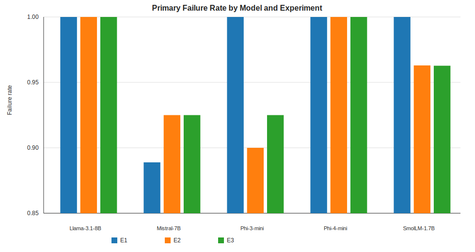
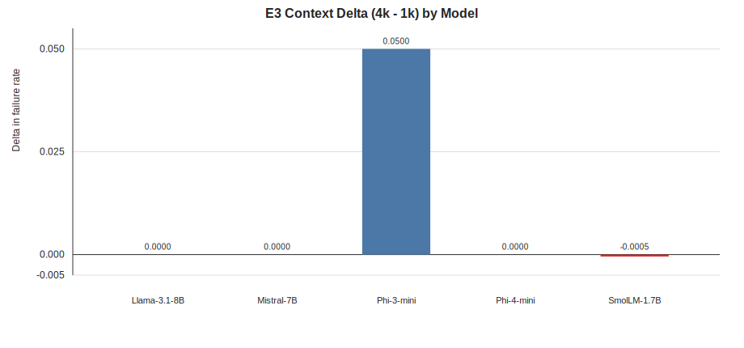
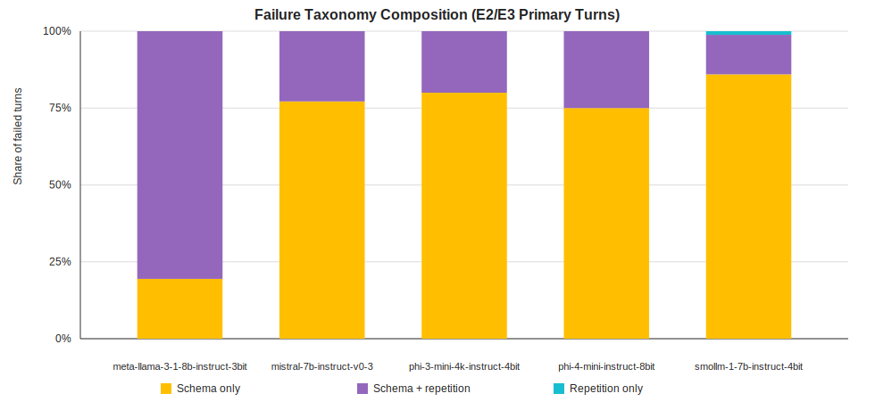

# drift_v0: Reliability Stress Testing of Local LLMs for Machine-Actionable Outputs

## Abstract
Deploying local large language models (LLMs) into operational workflows requires more than strong task performance: outputs must remain machine-actionable under constraint. We present `drift_v0`, a reproducible benchmark designed to measure operational reliability of local MLX-hosted models under strict output contracts, short-horizon state carryover, and context pressure. We evaluate five models across a 45-condition decoding grid (temperature `0.0/0.2/0.6`; top-p `0.8/0.95/1.0`) on three experiments: `E1` single-turn contract tasks, `E2` three-turn carried-state tasks, and `E3` context-pressure variants (`1k` versus `4k`). Failure rates are high in all settings (`E1`: `0.8889-1.0`, `E2`: `0.9-1.0`, `E3`: `0.925-1.0`). Mistral-7B-Instruct-v0.3 yields the best observed region (composite failure `0.9130`), while two families saturate at `1.0` failure. Intervention traces show strong detection but no recovery: retry effectiveness is `0.0` in every E2/E3 condition and escalation-after-retry is `1.0`. Post-hoc error analysis indicates dominant near-token-cap outputs and non-extractable schema failures, with repetition-only failures rare. The benchmark is therefore already useful as an accountability and triage instrument, but not yet as a recovery benchmark.

## 1. Introduction
Most LLM evaluation stacks emphasize capability: can a model solve a task when prompted correctly? In production, however, the first-order question is different: can a model solve the task while satisfying operational contracts that downstream systems depend on. In many workflows, an output that is semantically plausible but not parseable is still a failure.

This paper reports results from `drift_v0`, a reliability-focused experiment track built around that deployment constraint. The design target is not intelligence in the abstract, but sustained machine-actionability under realistic failure pressures: strict schema requirements, carried short-horizon context, bounded generation budget, and intervention policies that must be auditable when failures occur.

The practical motivation is governance as much as performance. If a model violates contract, the runtime should produce deterministic intervention signals (`retry`, `reset`, `escalate`) that can be routed to clear owners. That framing shifts evaluation from “did the model answer?” to “did the system remain operationally accountable?”

Using one full sweep run across five local models and 45 decoding conditions, we address three questions. First, does model family or decoding configuration explain more reliability variance? Second, does explicit context pressure in `E3` degrade reliability relative to `E2` in a meaningful and consistent way? Third, do first-pass retry policies recover failed turns, or merely route failures toward escalation?

The resulting evidence is mixed but actionable. The setup clearly discriminates model families in a high-failure regime, yet exhibits weak within-family sensitivity to decoding parameters. Likewise, current intervention prompts detect and route failures but do not recover them.

## 2. Experimental Design and Methodology
### 2.1 System pipeline
`drift_v0` uses a three-stage pipeline.

Stage 1 (generation) runs task packs against local models and emits raw event logs (`run_experiments.py`). Stage 2 (evaluation) applies deterministic trigger checks and intervention policies over those events (`evaluate_events.py`). Stage 3 (analysis) computes summary reliability metrics for reporting (`summarize.py`).

For broad parameter exploration, the sweep runner (`run_sweep.py`) executes all model/decoding combinations and writes condition-specific outputs under `/tmp/drift_v0_sweep/<condition_id>/report/`. This structure provides both per-condition machine-readable metrics and aggregate sweep views.

### 2.2 Models and decoding grid
The run includes five local MLX models:

1. Meta-Llama-3.1-8B-Instruct-3bit
2. Mistral-7B-Instruct-v0.3
3. Phi-3-mini-4k-instruct-4bit
4. Phi-4-mini-instruct-8bit
5. SmolLM-1.7B-Instruct-4bit

Each model is evaluated on a `3 x 3` decoding grid:

- temperature: `0.0`, `0.2`, `0.6`
- top-p: `0.8`, `0.95`, `1.0`

Total conditions are therefore `45` (`5 models x 3 temperatures x 3 top-p settings`).

### 2.3 Task packs and stress modes
We evaluate three experiments with increasing operational pressure.

`E1` is a single-turn contract baseline. It tests immediate schema/format compliance and basic output controllability.

`E2` introduces short-horizon carryover through three-turn episodes. The objective is to maintain contract while preserving local state consistency.

`E3` applies context-pressure variants (`1k` and `4k`) to E2-style tasks. This arm is intended to stress degradation behavior under changed context budgets and to surface interaction effects between memory burden and output contractability.

### 2.4 Failure triggers and interventions
The evaluator applies trigger checks for:

- `schema_failure`
- `repetition_loop`
- `state_contradiction`

When triggers fire, the closed-loop policy attempts one retry. If unresolved, control flows to reset/escalation pathways. This produces auditable intervention traces and allows direct measurement of whether retries function as recovery, not just detection.

### 2.5 Metrics
Primary endpoint is primary turn failure rate per experiment (`E1`, `E2`, `E3`).

Secondary endpoints include:

- retry effectiveness,
- escalation-after-retry rate,
- first-failure turn summaries,
- E3 degradation delta (`4k - 1k` failure-rate difference),
- post-hoc failure taxonomy composition.

For condition ranking we use a simple composite score:

`composite = mean(E1 failure, E2 failure, E3 failure)`

Lower composite means better reliability.

### 2.6 Data sources for this manuscript
All quantitative results in this draft are computed from sweep outputs and post-hoc CSV artifacts:

- `/tmp/drift_v0_sweep/sweep_manifest.csv`
- `/tmp/drift_v0_sweep/<condition_id>/report/metrics_summary.json`
- `/tmp/drift_v0_failure_cause_by_model.csv`
- `/tmp/drift_v0_failure_cause_overall.csv`

Figures and summary tables were generated via:

```bash
python3 research/papers/drift_v0/generate_assets.py
```

## 3. Results
### 3.1 Overall reliability regime
Across all 45 conditions, failures remain high:

- `E1`: `0.8889-1.0`
- `E2`: `0.9-1.0`
- `E3`: `0.925-1.0`

This confirms the benchmark is operating in a strict regime. The system is not measuring small quality differences around low error rates; it is measuring brittleness under hard contract constraints.

### 3.2 Model-family effects dominate decoding effects
Table 1 reports mean failure rates by model family (averaged across all temperatures and top-p values).

| Model | E1 mean | E2 mean | E3 mean | Composite mean |
|---|---:|---:|---:|---:|
| Mistral-7B-Instruct-v0.3 | 0.8889 | 0.9250 | 0.9250 | 0.9130 |
| Phi-3-mini-4k-instruct-4bit | 1.0000 | 0.9000 | 0.9250 | 0.9417 |
| SmolLM-1.7B-Instruct-4bit | 1.0000 | 0.9630 | 0.9627 | 0.9752 |
| Meta-Llama-3.1-8B-Instruct-3bit | 1.0000 | 1.0000 | 1.0000 | 1.0000 |
| Phi-4-mini-instruct-8bit | 1.0000 | 1.0000 | 1.0000 | 1.0000 |

The first-order observation is separation by family, not by decoding setting. For example, all top-ranked conditions correspond to Mistral-7B and show identical scores across every tested temperature/top-p pair. Conversely, Llama-3.1-8B and Phi-4-mini saturate at full failure in this protocol regardless of decoding parameters.

This pattern suggests that for this workload, choosing the model family matters substantially more than tuning sampling settings within the tested ranges.



### 3.3 Best observed operating region
The nine best conditions are exactly the nine Mistral-7B grid points, each with:

- `E1 = 0.8889`
- `E2 = 0.925`
- `E3 = 0.925`
- composite `= 0.9130`

Operationally, this invariance is useful: it indicates a stable “best observed region” that is robust to moderate decoding changes, at least within the explored grid.

### 3.4 Context-pressure signal in E3 is weak except one family
The E3 degradation metric (`4k - 1k`) is near zero for most families:

- Llama-3.1-8B: `0.0000`
- Mistral-7B: `0.0000`
- Phi-4-mini: `0.0000`
- SmolLM-1.7B: `-0.0005` (practically null)
- Phi-3-mini: `+0.0500`

Sweep-wide mean delta is `+0.0099`.

The intended E3 stressor therefore does not produce broad, consistent degradation separation. Phi-3-mini is the main exception, where the delta is materially larger than the rest of the cohort.



### 3.5 Retry policy behavior: detection without repair
Across all condition reports, retry effectiveness in E2/E3 is always `0.0`, while escalation-after-retry is always `1.0`.

This is an important systems result. The intervention layer is clearly active and deterministic, but it currently functions as a routing gate to escalation, not a recovery mechanism. In other words, the policy is operationally useful for accountability and triage but does not yet provide resilience through self-repair.

### 3.6 Failure taxonomy: contractability failures dominate
Post-hoc analysis of E2/E3 primary turns shows `8100` rows with `7677` failed (`0.9478` fail rate). Within failed turns:

- near-token-cap outputs: `6804` (`88.63%`)
- non-extractable schema failures: `6579` (`85.70%`)
- extractable schema failures: `1080` (`14.07%`)
- repetition-only failures: `18` (rare)

This profile argues against a pure “memory failure” interpretation. The dominant issue is contractability under constrained generation budgets, often producing outputs that cannot be safely extracted.

Model-level composition reinforces this point. Mistral has a lower failure rate (`0.9`) and a much larger extractable share among failures (`56.17%`) than other families. Llama and SmolLM fail mostly via non-extractable schema outputs (`97.78%` and `97.66%` of failed turns respectively).



## 4. Discussion
Three conclusions follow from this run.

First, the benchmark is already effective at exposing reliability cliffs and differentiating model families under strict machine-actionable constraints. This is valuable for model selection where downstream automation cannot tolerate wrapper text, truncation artifacts, or malformed structures.

Second, the current design has ceiling effects. High baseline failure compresses variation and makes it harder to isolate secondary effects such as within-family decoding sensitivity. Similarly, E3 pressure is not yet consistently discriminative across families.

Third, intervention design is now the limiting factor for resilience. Because retries never recover in this sweep, reliability gains are unlikely to come from better routing alone. They will require stronger repair steps, softer extraction pathways, or both.

These findings suggest a useful separation of concerns for next iteration: keep strict triggers for accountability, but introduce explicit repair layers for recovery benchmarking.

## 5. Limitations
This study has several concrete limitations.

The validator is intentionally strict and may classify wrapper-containing responses as failures even when payload fragments are recoverable. This is useful for hard contract measurement, but it can overstate practical failure for workflows with tolerant parsers.

The generation budget (`max_tokens=256`) likely contributes to near-cap and schema truncation failures, especially in state-heavy steps. Some observed failures may therefore be budget-induced rather than purely cognitive.

E3 currently yields weak separation for most families, indicating that the stressor design may need recalibration to produce interpretable degradation gradients.

Finally, results are specific to this task and prompt-contract profile. They should be interpreted as operational reliability evidence for this regime, not as universal model rankings.

## 6. Conclusion
`drift_v0` demonstrates that reliability evaluation for local LLM deployment can be run reproducibly and interpreted operationally. In this sweep, model-family choice strongly affects outcomes, decoding settings within tested ranges do not, and first-order retries fail to recover any E2/E3 failures.

The benchmark is therefore immediately useful for triage, escalation governance, and failure-mode auditing. Its next phase should focus on converting deterministic detection into measurable recovery.

## 7. Recommended Next Iteration
1. Split hard versus soft schema failures in official metrics (e.g., wrapper-tolerant extraction path plus strict path).
2. Add an explicit repair baseline after primary failure (deterministic reformatter or second-pass repair model).
3. Recalibrate contract prompts and token budgets to reduce ceiling effects while preserving strictness.
4. Re-run a targeted grid around top families with stronger E3 context-pressure differentials.

## Appendix: Generated Assets
- `research/papers/drift_v0/tables/model_summary.csv`
- `research/papers/drift_v0/tables/best_conditions_top10.csv`
- `research/papers/drift_v0/figures/figure1_failure_rates_by_model.svg`
- `research/papers/drift_v0/figures/figure2_e3_delta_by_model.svg`
- `research/papers/drift_v0/figures/figure3_failure_taxonomy_by_model.svg`
